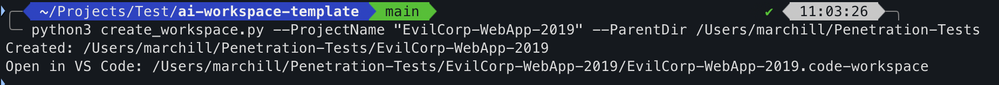
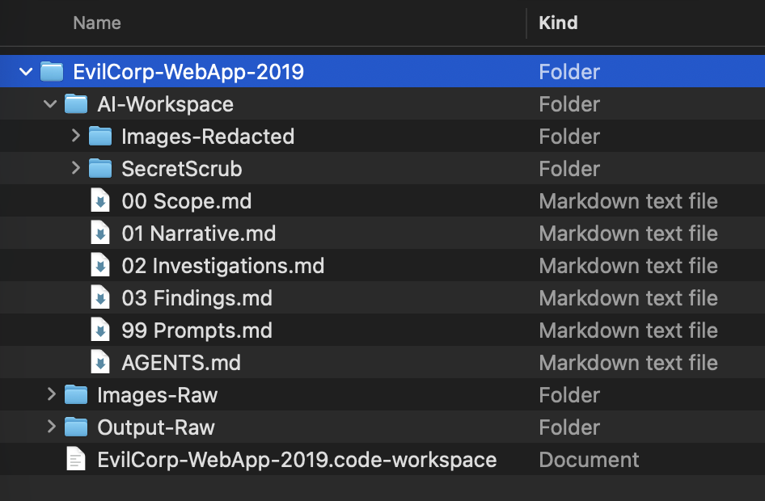

# WebAppPenTest-AIWorkflow

Create a consistent workspace for AI-assisted web application penetration testing on Windows, macOS, and Linux. The tester controls scope and testing; the AI workspace holds approved sanitised evidence and Markdown working records.

## Requirements

- Python 3.9 or newer; no additional Python packages needed.
- Git to clone this repository (or download and extract its ZIP).
- VS Code to use the included workspace file. Markdown files also work in other editors.

## Get the template

```sh
git clone https://github.com/Tarian-Labs/WebAppPenTest-AIWorkflow.git
cd WebAppPenTest-AIWorkflow
```

## Create a project

Windows (PowerShell or Command Prompt):

```powershell
py create_workspace.py --ProjectName "Client-WebApp" --ParentDir "C:\PenetrationTests"
```

macOS:

```sh
python3 create_workspace.py --ProjectName "Client-WebApp" --ParentDir "/Users/yourname/PenetrationTests"
```

Linux:

```sh
python3 create_workspace.py --ProjectName "Client-WebApp" --ParentDir "/home/user/tests"
```

Example run creating `EvilCorp-WebApp-2019` on macOS:



Both arguments are required and case-sensitive:

| Argument | Purpose |
| --- | --- |
| `--ProjectName` | Single new directory name, such as `Client-WebApp` or `Client WebApp`. |
| `--ParentDir` | Directory where the project will be created; created if missing. |

Quote paths containing spaces. Use paths appropriate to your operating system. An existing writable parent, a drive root such as `C:\` on Windows, relative paths, and `~` for your home directory are supported. Relative parent paths are resolved from your current working directory. Your account needs permission to create the destination.

The script finds `template/` beside itself, so you can also run it using its full path from any directory. Keep the script and template together. It refuses to overwrite an existing destination and rejects names that are invalid on Windows, macOS, or Linux.

For help:

```sh
python3 create_workspace.py --help
```

On Windows, substitute `py` for `python3`.

## Generated project

```text
Client-WebApp/
├── AI-Workspace/
│   ├── AGENTS.md
│   ├── 00 Scope.md
│   ├── 01 Narrative.md
│   ├── 02 Investigations.md
│   ├── 03 Findings.md
│   ├── 99 Prompts.md
│   ├── SecretScrub/
│   └── Images-Redacted/
├── Images-Raw/
├── Output-Raw/
└── Client-WebApp.code-workspace
```

The generated `EvilCorp-WebApp-2019` project in Finder:



Open the generated `.code-workspace` file using VS Code's **File → Open Workspace from File**. It opens only `AI-Workspace/` using a relative path, so the whole project can be moved without editing the workspace file. This is an organisational boundary, not a technical sandbox; agent tools may still be able to access other locations. Whether an AI tool automatically reads `AGENTS.md` depends on that tool.

1. Fill in `00 Scope.md` with tester-approved targets, exclusions, rules of engagement, and constraints.
2. Put sanitised JSONL exports in `SecretScrub/` and approved redacted screenshots in `Images-Redacted/`.
3. Use the narrative, investigations, and findings records to track work, and `99 Prompts.md` for a passive review starting point.

The generator does not install SecretScrub, sanitise evidence, run tests against targets, or create a Burp project. Raw material belongs in the sibling raw directories. Do not commit engagement evidence to this public template repository; generate projects in a separate parent directory.

## Customise the template

Edit the files in `template/` before generating new projects. Existing generated projects are unaffected. Empty evidence directories are created by the script because Git does not track empty directories. The workspace template is renamed automatically to match the project name.

## Verify the generator

```sh
python3 -m unittest discover -s tests -v
```

These tests use temporary directories and do not interact with testing targets.
